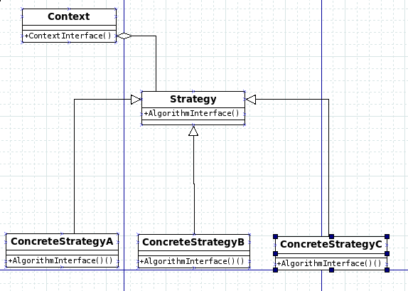

##Strategy Algorithm 

### Define a family of algorithms, encapsulate each one, and make them interchangeable. Strategy lets the algorithmvary independently from cliens that use it.

###the Context class is used to configure the ConcreteStrategy and maintain the reference of ConcreteStrategy. 
